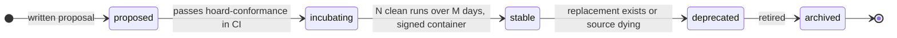
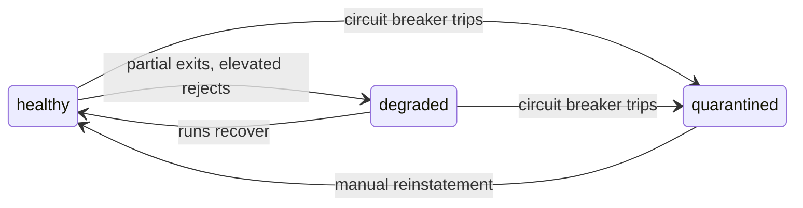

Records have a lifecycle; so do modules. Governance state lives in the [registry](/module-lifecycle/orchestration#stage-3--registry).

## Governance states

| State | Meaning | Bar to enter |
|---|---|---|
| `proposed` | Idea / design issue in the org | A written proposal naming the feed type and source |
| `incubating` | Repo exists, runs against staging | Passes `hoard-conformance` in CI |
| `stable` | Runs in production | N clean production runs over M days, containerized + signed artifact, docs, a named maintainer |
| `deprecated` | Scheduled for retirement, still runs | A replacement exists or the source is dying |
| `archived` | No longer invoked | Registry entry retained; historical records keep their lineage |

<Callout title="Health is orthogonal to state">
  A `stable` module can be `healthy`, `degraded` (partial exits, elevated rejects), or `quarantined` (circuit breaker tripped). During `incubating`, plain-CLI invocation is acceptable for iteration speed; promotion to `stable` requires the pinned, signed container.
</Callout>

## Observability & feed quality

Every run yields metrics (from the run report plus the validation gate): records emitted, rejected, duplicate rate, novelty rate (share not already in the store), and latency. Rolled up per module over time, these form a **feed quality scorecard**:

### Timeliness

Lag between a source publishing and Hoard ingesting.

### Novelty / overlap

How much a feed contributes that no other feed does. Public feeds overlap far less than people assume and vary wildly in quality; measuring this is how you decide which modules earn their upkeep.

### Hygiene

Gate reject rate and downstream false-positive rate from [consumer feedback](/module-lifecycle/storage-and-distribution#consumer-feedback).

<Callout>
  The scorecard is also a community artifact: it makes "which module does the project need next" an evidence-backed question instead of a vibe.
</Callout>
