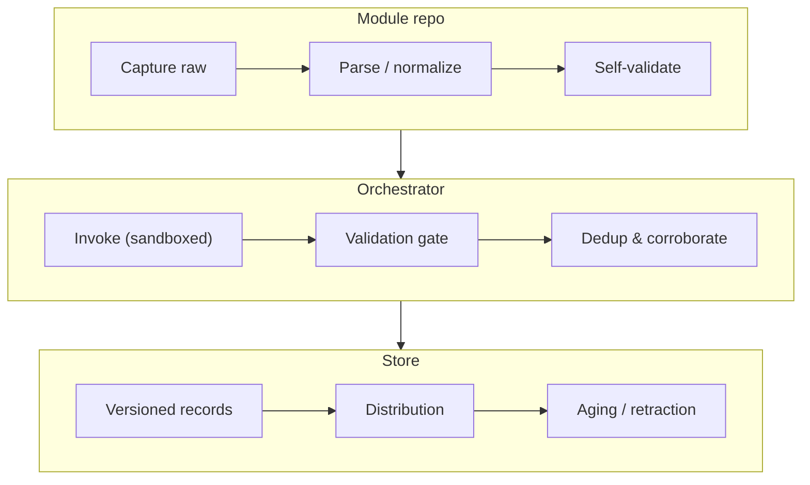

import { LayersIcon, RouteIcon } from 'lucide-react';

Every Hoard CTI feed — CVEs, IOCs, threat actor profiles, hidden service indexes — lives in its own independent repo, called a **module**. This section describes the contract every module must satisfy, the stages the central orchestrator runs each module through, and the governance model that lets community modules join the project without joining its trusted computing base.

## Two lifecycles

Two lifecycles run in parallel here, and they're easy to conflate:

<Cards>

  <Card icon={<RouteIcon />} title='Record lifecycle (data plane)'>

    capture → normalize → validate → ingest → corroborate → store → distribute → age out.
    Covered by the ten pipeline stages in this section.

  </Card>

  <Card icon={<LayersIcon />} title='Module lifecycle (control plane)'>

    How a module enters the ecosystem, gets promoted to production, degrades, and retires.
    See [Module Governance](/module-lifecycle/governance).

  </Card>

</Cards>

## The pipeline at a glance

A module's internal logic is unconstrained — it can scrape, parse, and enrich however it needs to. What's constrained is the **boundary**: every module exposes the same fixed interface, so the central orchestrator can invoke any module without knowing anything about what's inside it.

## Two principles, every stage

<Callout title="Modules are semi-trusted">
  Everything a module emits is independently re-validated, everything it runs in is sandboxed, and misbehavior quarantines the module automatically. This is what lets the project accept community modules without accepting community risk.
</Callout>

<Callout title="Everything is replayable">
  Raw source data is archived before parsing, rejects are quarantined rather than dropped, and record IDs are deterministic. Any stage can be re-run after a fix without re-scraping the source — which matters most for sources that disappear (hidden services especially).
</Callout>

## Where to go next

| Page | Covers |
|---|---|
| [The Schema System](/module-lifecycle/schema-system) | The Hoard schema — versioned JSON Schema documents published at stable URLs, the shared data contract behind every stage |
| [The Module Contract](/module-lifecycle/module-contract) | Module internals, the manifest, entrypoint semantics, self-validation, and the conformance kit (Stages 1–2) |
| [Registry & Invocation](/module-lifecycle/orchestration) | The module registry, sandboxed execution, scheduling, cursors, and backfill (Stages 3–4, 10) |
| [Validation & Deduplication](/module-lifecycle/validation-and-dedup) | The central validation gate, quarantine, deterministic IDs, and corroboration-aware merging (Stages 5–6) |
| [Storage & Distribution](/module-lifecycle/storage-and-distribution) | The versioned bitemporal store, TLP/license-enforced egress, and record aging (Stages 7–9) |
| [Module Governance](/module-lifecycle/governance) | Governance states, module health, and the feed quality scorecard |
| [Design Decisions](/module-lifecycle/design-decisions) | Resolved architectural decisions, open questions, and schema implications |
