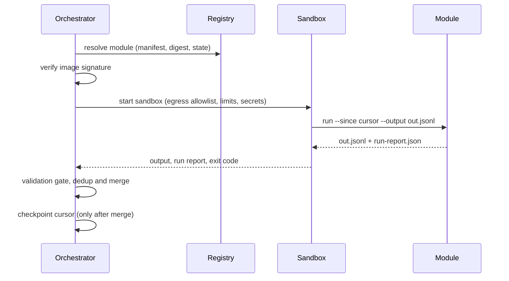

The orchestrator is the only component that invokes modules, and it does so through a registry, a sandbox, and per-module state. This page covers Stages 3, 4, and 10 of the record lifecycle.

## Stage 3 — Registry

The orchestrator maintains a registry of known modules. For each module it records:

- The module's repo
- A manifest snapshot
- The pinned artifact digest per version
- Its governance state (see [Module Governance](/module-lifecycle/governance))
- Its schema-compatibility range

This is what makes "the central feed calls the repo" concrete instead of an ad hoc integration written per module.

<Callout title="The registry is a supply-chain artifact">
  It should be a signed, reviewed file (or small service) — adding or promoting a module is a change that goes through review, not a config edit. Discovery via GitHub org topics can seed it, but the registry, not the org listing, is the source of truth for what runs.
</Callout>

## Stage 4 — Invocation (sandboxed)

The orchestrator pulls the module's container image **by pinned digest**, verifies its signature (cosign or equivalent), and runs it on schedule inside a locked-down sandbox:

- Default-deny network egress; only the manifest's `egress` allowlist is reachable
- Read-only root filesystem, scratch space on tmpfs
- Non-root, with CPU / memory / wall-clock limits from the manifest
- Secrets injected as env vars or mounted files at runtime only

Output is captured as JSONL from the declared output path — each line a record conforming to the module's declared [hoard-schema version](/module-lifecycle/schema-system) — and the run report is collected with it.

### Failure handling

Runs are **at-least-once**: the orchestrator retries transient failures with backoff, and downstream idempotency (deterministic IDs + dedup) makes retries safe.

A **circuit breaker** quarantines the module itself — not just its records — when a threshold trips:

- N consecutive fatal exits
- Gate reject rate above X%
- Emission volume far outside its rolling baseline

Quarantined modules stop being scheduled and page a maintainer; reinstatement is manual.

## Stage 10 — Scheduling, state & backfill

Each module's manifest declares a cadence hint; the orchestrator owns the actual schedule. Per module, it tracks:

### Cursor

An opaque, module-defined token stored by the orchestrator and passed back via `--since`. It's checkpointed only after the run's records clear the gate and merge, so a mid-pipeline failure means reprocessing — safe, because IDs are deterministic.

### Freshness

Alert when a module hasn't produced within roughly 2× its cadence. Silence is a failure mode, not the absence of one.

### Backfill mode

Replay archived raw captures through parse → gate → merge without touching the source. This is the payoff of raw-first capture: when a parser improves or a schema gains a field, history is recoverable even if the source no longer exists.
