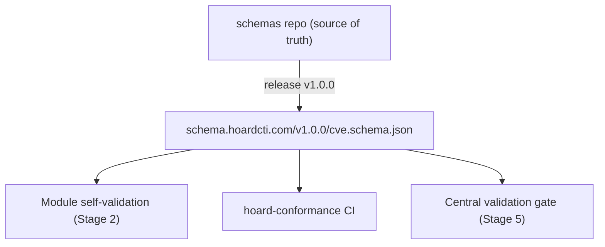

JSONL is only the framing; the actual data contract is the **Hoard schema**, and every reference to "the schema" in this section means the same concrete thing.

## Single source of truth

The [`schemas` repo](https://github.com/hoardcti/schemas) is the single source of truth. Each `feed_type` has its own payload schema (e.g. `v1.0.0/cve.schema.json`), written as **JSON Schema draft 2020-12**.

## Versioned and published at stable URLs

Schemas are **versioned by release directory** (`v1.0.0/…`) and **published at stable URLs**:

```
https://schema.hoardcti.com/v1.0.0/cve.schema.json
```

Each schema's `$id` is set to its published URL, so any validator anywhere resolves the same document.

## Payloads declare their version

A payload **declares the schema version it conforms to** (a `schema_version` field pinned by the schema itself). Combined with the manifest's `feed_type`, this is how the module's [self-validation](/module-lifecycle/module-contract#4-self-validation), the registry's compatibility range, and the [central gate](/module-lifecycle/validation-and-dedup#stage-5--validation-gate) all agree on exactly which schema document applies — no stage carries a private copy of the rules.



## Immutable once released

The schemas are **themselves CI-validated** (syntax/style checks plus recursive meta-schema validation) and immutable once released: a module pinning a `schema_version` gets a contract that cannot shift underneath it.

Schema evolution happens by publishing a new version directory, and modules migrate by updating their manifest's `schema_version`.

<Callout title="Validated twice, against the same document">
  Every JSONL line a module emits must validate against the published schema for its `feed_type` and declared `schema_version` — first inside the module (Stage 2 self-validation), then again at the central gate (Stage 5).
</Callout>
