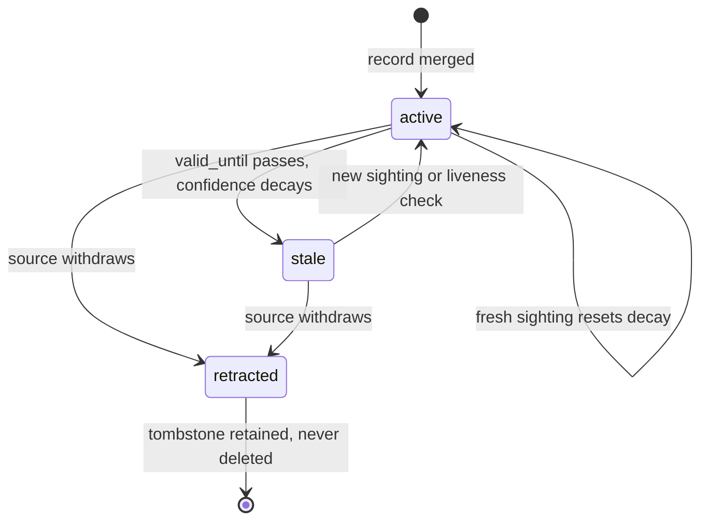

Once a record clears the gate and merges, the store takes over — and the store's obligations follow records out the door. This page covers Stages 7, 8, and 9 of the record lifecycle.

## Stage 7 — Central store

Deduplicated, validated records land in the queryable store, keyed off the standardized envelope fields (type, TLP, provenance, etc.), with three properties:

### Versioned, not overwritten

New information supersedes; prior versions are retained. Retractions are tombstones, not deletes.

### Bitemporal

`observed_at` (what the source asserted, and when) is distinct from `ingested_at` (when Hoard saw it), plus `valid_from` / `valid_until` for the claim itself.

<Callout title="Why two time axes?">
  CTI questions are often "what did we believe on date X" — unanswerable without both axes.
</Callout>

### Lineage

Every record version links to the run ID, module version, and raw-capture blob that produced it. Any record can be traced back to the exact bytes it came from.

## Stage 8 — Distribution

Aggregation exists to be consumed:

- **TLP and license are enforced at egress**, not just recorded. A TLP:AMBER record doesn't appear in the public dump; a record whose source license forbids redistribution doesn't leave, period.
- Native outputs come first: JSONL dumps and a query API speaking hoard-schema.
- **Interop lives at the boundary.** A STIX 2.1 export adapter (and later TAXII 2.1) translates hoard-schema outward for tools that expect it. Keeping STIX as a boundary translation rather than the internal format keeps the internal schema honest and the interop obligation contained.

## Stage 9 — Aging, retraction & feedback

Intelligence decays; the lifecycle has to say how.

### Per-type validity defaults

An IP indicator goes stale in days-to-weeks; a file hash is nearly permanent; a CVE record never expires but its metadata refreshes. Each payload schema declares a default `valid_until` horizon; sources can override it.

### Confidence decay

Aggregate confidence decays as a function of time since `last_seen`, tuned per feed type (MISP's decaying-models work is good prior art). A fresh sighting resets the clock.

### Retraction

When a source deletes or withdraws a record, it's tombstoned with the retraction recorded — consumers can see *that* it was withdrawn and when, which is itself intelligence.

### Re-validation

Some types support active liveness checks (is the onion service still up?) that refresh `last_seen` without a new source report.

### Consumer feedback

Sighting confirmations and false-positive reports from downstream consumers flow back into confidence. This loop is what separates a curated aggregator from a pile of feeds.
