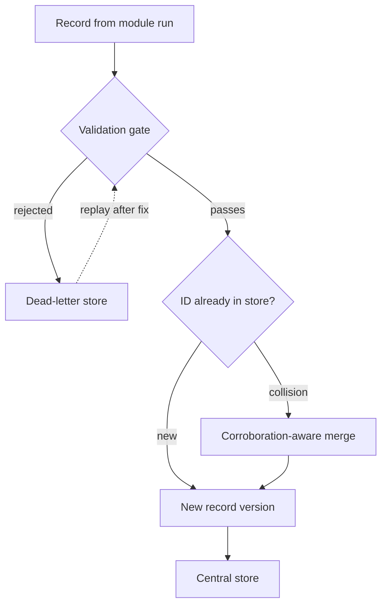

Everything a module emits crosses a trust boundary before it touches the store. This page covers Stages 5 and 6 of the record lifecycle.

## Stage 5 — Validation gate

The central feed re-validates every record against the schema, independent of the module's self-check. The gate resolves the same published schema document the module claims to target — from the `feed_type` and `schema_version` in the manifest and run report, via the schema's [published URL](/module-lifecycle/schema-system) — rather than trusting the module's copy.

<Callout title="Both, always">
  The self-check runs *inside* the semi-trusted boundary; the gate **is** the trust boundary. Neither replaces the other.
</Callout>

Beyond raw schema validation, the gate checks:

- **Envelope completeness** — provenance, TLP (constrained to the TLP 2.0 vocabulary: CLEAR / GREEN / AMBER / AMBER+STRICT / RED), confidence, license, and raw reference are checked for presence and validity, not just the type-specific payload
- **Temporal sanity** — `observed_at` ≤ `ingested_at`, no future timestamps, source window within tolerance
- **Size and shape limits** — max record size, records-per-run vs. the module's baseline

### Quarantine, not drop

Rejected records go to a dead-letter store with the raw JSONL line, the rejection reason, the run ID, and the module version — enough context to debug the offending module *and* to replay the records through the gate after the module or schema is fixed.

Silent drops are how feeds lie to you.

## Stage 6 — Dedup & corroboration

Deduplication is by **deterministic record ID**. Each payload schema declares its *identity key fields*:

| Feed type | Identity key |
|---|---|
| IOC | type + value |
| CVE record | CVE ID |
| Hidden service | onion address |

Those fields are canonicalized (RFC 8785 JSON canonicalization) and the ID is derived from them — e.g. UUIDv5 over feed type + canonical key.

<Callout type="warn" title="Identity is the thing being described">
  Never the whole record — two feeds reporting the same IOC with different confidence values **must** collide.
</Callout>

### Collisions are signal, not noise

A record reported by multiple independent feeds is *more* credible, so the merge is **corroboration-aware**:

- `provenance` becomes a list — every reporting source is retained, each with its own per-source confidence
- `sighting_count`, `first_seen`, and `last_seen` are maintained on the merged record
- Aggregate confidence is derived from the per-source values; independent corroboration raises it
- TLP resolves to the **most restrictive** value across sources
- License resolves to whatever most restricts redistribution — this governs [distribution](/module-lifecycle/storage-and-distribution#stage-8--distribution)

### Dedup is not correlation

Cross-feed *correlation* (linking a CVE to an IOC to an actor) remains a later-stage concern. Dedup answers "are these the same record?"; correlation answers "are these records related?" — different problems, different machinery.
